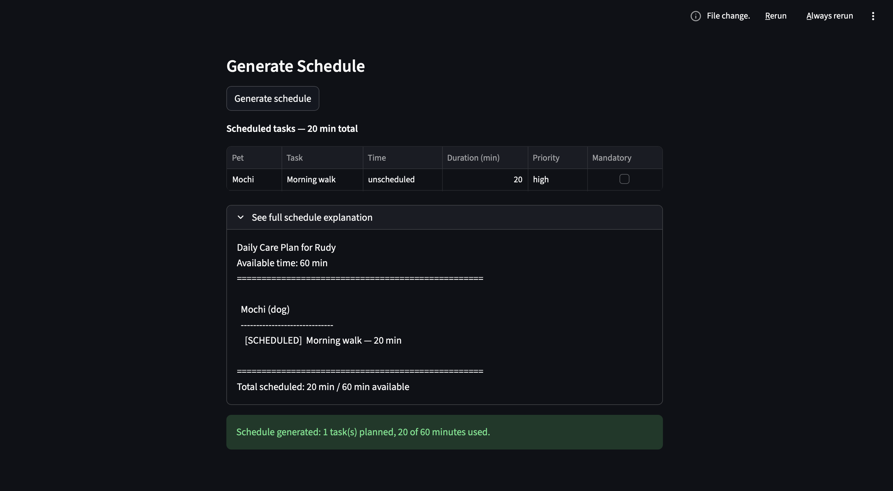

# PawPal+ (Module 2 Project)

You are building **PawPal+**, a Streamlit app that helps a pet owner plan care tasks for their pet.

## Scenario

A busy pet owner needs help staying consistent with pet care. They want an assistant that can:

- Track pet care tasks (walks, feeding, meds, enrichment, grooming, etc.)
- Consider constraints (time available, priority, owner preferences)
- Produce a daily plan and explain why it chose that plan

Your job is to design the system first (UML), then implement the logic in Python, then connect it to the Streamlit UI.

## Features

- **Task scheduling based on time and priority** — `Scheduler.generate_plan()` always includes mandatory tasks first, then fills remaining available minutes with non-mandatory tasks sorted high → medium → low priority, using task name as a stable tiebreaker.
- **Sorting tasks by time** — `Scheduler.sort_by_time()` orders any task list chronologically by `scheduled_time` in HH:MM format; tasks with no scheduled time sort to the end.
- **Filtering tasks by pet and completion status** — `Scheduler.filter_by_pet()` and `Scheduler.filter_by_status()` scope the task list to a specific pet or to completed/incomplete tasks; both are used live in the Streamlit UI.
- **Recurring tasks (daily/weekly regeneration)** — completing a recurring task via `Pet.complete_recurring_task()` automatically creates the next occurrence with the correct future `due_date`; duplicate-future-instance protection prevents double creation.
- **Conflict detection with warning messages** — `Scheduler.detect_time_conflicts()` flags active tasks that share a `scheduled_time` slot, labels same-pet versus cross-pet conflicts, and surfaces plain-language warnings in the UI without crashing the program.
- **CLI demo + Streamlit UI integration** — all scheduling logic lives in `pawpal_system.py`; `app.py` connects it to a Streamlit interface with owner setup, pet management, task entry, live conflict warnings, filter controls, and a generated schedule view.
- **Automated test suite (pytest)** — 40 tests across 6 tiers covering task validation, plan generation, recurring task state transitions, conflict detection, and filter/sort correctness.

## What you will build

Your final app should:

- Let a user enter basic owner + pet info
- Let a user add/edit tasks (duration + priority at minimum)
- Generate a daily schedule/plan based on constraints and priorities
- Display the plan clearly (and ideally explain the reasoning)
- Include tests for the most important scheduling behaviors

## Smarter Scheduling

Phase 4 added algorithmic improvements to make PawPal+ more useful for day-to-day pet care:

- **Sort by time** — `Scheduler.sort_by_time()` orders any task list chronologically by `scheduled_time`; unscheduled tasks sort last.
- **Filter tasks** — `filter_by_status()` and `filter_by_pet()` let you scope the task list to incomplete tasks or a specific pet.
- **Recurring tasks** — completing a daily or weekly task via `Pet.complete_recurring_task()` automatically creates the next occurrence with the correct future `due_date`.
- **Conflict detection** — `Scheduler.detect_time_conflicts()` flags active tasks that share a `scheduled_time` slot and returns human-readable warnings without crashing the program.

## Getting started

### Setup

```bash
python -m venv .venv
source .venv/bin/activate  # Windows: .venv\Scripts\activate
pip install -r requirements.txt
```

### Suggested workflow

1. Read the scenario carefully and identify requirements and edge cases.
2. Draft a UML diagram (classes, attributes, methods, relationships).
3. Convert UML into Python class stubs (no logic yet).
4. Implement scheduling logic in small increments.
5. Add tests to verify key behaviors.
6. Connect your logic to the Streamlit UI in `app.py`.
7. Refine UML so it matches what you actually built.

## Testing PawPal+

Run the full automated test suite from the project root:

```bash
python -m pytest
```

To run with verbose output (recommended to see individual test names):

```bash
python -m pytest tests/test_pawpal.py -v
```

### What the tests cover

- **Task completion** — `mark_complete()` updates `completed` status correctly; calling it twice on a non-recurring task raises `RuntimeError`.
- **Task addition** — `Pet.add_task()` increments the task list and rejects exact and case-insensitive duplicate names with `ValueError`.
- **Sorting correctness** — `Scheduler.sort_by_time()` orders tasks from earliest to latest `scheduled_time`; tasks with no `scheduled_time` always sort to the end.
- **Recurring task behavior** — completing a daily or weekly task via `Pet.complete_recurring_task()` creates exactly one new occurrence with the correct next `due_date`, marks the current instance complete, and prevents duplicate future occurrences from being created on a second call.
- **Conflict detection** — `Scheduler.detect_time_conflicts()` flags active tasks sharing a `scheduled_time` slot, labels same-pet vs. cross-pet conflicts correctly, and excludes completed or future-due tasks from triggering false warnings.

### Test suite summary

| Tier | Area | Tests |
| ------ | ------ | ------- |
| Foundation | Task validation, duplicate protection | 8 |
| Core scheduling | Plan generation, mandatory tasks, budget overrun | 7 |
| Recurring logic | Daily/weekly cadence, duplicate protection, `ValueError` guard | 6 |
| Conflict detection | Same-pet, cross-pet, completed/future exclusion | 5 |
| Filter and sort | `filter_by_status`, `filter_by_pet`, `sort_by_time` | 7 |
| Phase 5 required | Sorting, recurrence, conflict — algorithmic correctness | 3 |
| **Total** | | **40** |

**Confidence Level:** ★★★★☆ (4/5)

The suite provides strong coverage of core scheduling logic, recurring task state transitions, conflict detection rules, and input validation. Room remains for additional edge-case coverage: multi-pet plans with mixed mandatory/non-mandatory tasks and tight budgets, weekly recurring tasks completing across month boundaries, and owner-level remove operations followed by re-scheduling.

## 📸 Demo

<a href="images/pawpal_screenshot.png" target="_blank">
  
</a>
