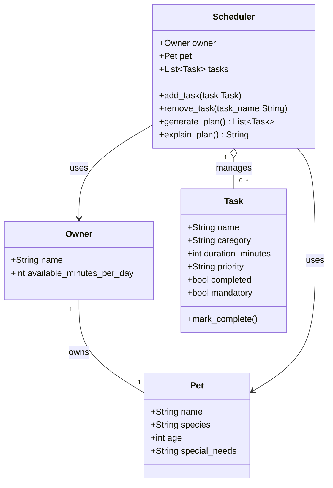

# PawPal+ Project Reflection

## 1. System Design

**a. Initial design**

The three core actions a user should be able to perform in PawPal+ are:

1. **Set up their pet profile** — The user enters basic information about themselves and their pet, such as the pet's name, species, age, special needs, and how much time the owner has available each day. This gives the app the context and constraints needed to personalize care planning.

2. **Add and edit care tasks** — The user creates tasks such as walks, feedings, medication, grooming, or enrichment. Each task includes at minimum a duration and priority level, and some tasks may also be marked mandatory. This allows the system to distinguish between important tasks and tasks that cannot be skipped.

3. **Generate and view today's plan** — The user asks the scheduler to produce a daily care plan. The app selects and orders tasks based on available time, task priority, and whether a task is mandatory, then shows the resulting plan with a short explanation of why tasks were included or skipped.

The initial design uses four classes: `Owner`, `Pet`, `Task`, and `Scheduler`.

`Owner` is a simple data class that holds the owner's name and the number of minutes they have available for pet care each day. Its only responsibility is to carry that time constraint into the scheduler.

`Pet` is also a data class. It stores the pet's name, species, age, and any special needs such as medication or dietary restrictions. It does not contain logic — it exists purely to give the scheduler context about what kind of care the pet requires.

`Task` represents a single care activity. It holds the task name, category, duration in minutes, a priority level (high, medium, or low), a completion flag, and a mandatory flag. The mandatory flag is what separates tasks that must happen regardless of time — like medication — from tasks that are merely important. `Task` has one method, `mark_complete()`, which sets the completed flag to true. Behavior belongs with the data it mutates, so this method lives on `Task` rather than on the scheduler.

`Scheduler` is the only class that contains real logic. It holds a reference to an `Owner`, a `Pet`, and a list of `Task` objects. It is responsible for adding and removing tasks, generating a daily plan that respects the owner's time limit and task priorities, and producing a plain-language explanation of which tasks were scheduled and why others were skipped. The separation between `generate_plan()` and `explain_plan()` keeps data processing and output formatting in distinct methods.

**Classes and responsibilities:**

| Class | Responsibility |
| --- | --- |
| `Owner` | Stores owner profile and the available time constraint (`available_minutes_per_day`) |
| `Pet` | Stores pet profile and care context (`species`, `age`, `special_needs`) |
| `Task` | Represents one care task with duration, priority, completion state, and a `mandatory` flag |
| `Scheduler` | Core logic — holds references to `Owner`, `Pet`, and a task list; generates and explains the daily plan |

**UML class diagram (corrected version):**

**b. Design changes**

Three changes were made after reviewing the skeleton against the design.

**1. Relationship correction — Scheduler → Owner and Scheduler → Pet**
The initial diagram used composition (`*--`) for both relationships. This was corrected to association (`-->`), because `Owner` and `Pet` exist independently of the `Scheduler`. Destroying the scheduler should not destroy the owner or pet. Aggregation (`o--`) was kept for `Task` because the scheduler manages a collection of tasks that can be added or removed without owning their lifecycle.

**2. Added `mandatory: bool` to Task**
High priority alone does not mean a task must happen. A medication task, for example, cannot be skipped just because time runs out. The `mandatory` flag was added to make that distinction explicit in the model. Without it, `generate_plan()` would have no way to differentiate "skip if needed" from "never skip."

**3. Added `PRIORITY_ORDER` constant and fixed `explain_plan()` signature**
A review of the skeleton identified two logic bottlenecks. First, `priority` is stored as a plain string (`"high"`, `"medium"`, `"low"`), which cannot be sorted directly. A module-level `PRIORITY_ORDER` dictionary mapping each label to an integer rank was added so `generate_plan()` can sort tasks correctly without duplicating that mapping inside the method.

Second, `explain_plan()` was originally designed to call `generate_plan()` internally with no parameters. This means the plan would be computed twice whenever a caller used both methods. The signature was updated to `explain_plan(self, plan: list[Task] | None = None)` so a caller can pass in a pre-computed plan and avoid redundant work. If no plan is provided, `explain_plan()` will generate one itself.

---

## 2. Scheduling Logic and Tradeoffs

**a. Constraints and priorities**

The scheduler considers three main constraints: available time, task priority, and whether a task is mandatory. Available time is the hard limit because the owner may only have a certain number of minutes each day for pet care. Priority helps the system decide which non-mandatory tasks should be scheduled first when there is not enough time to complete everything. The mandatory flag is treated as even more important than priority because some tasks, such as medication or feeding, should not be skipped simply because time is limited.

These constraints were chosen because they directly reflect the scenario. The app is supposed to help a busy owner make decisions under limited time, so the scheduler needs to optimize around scarce time while still protecting the pet's essential needs. The first version stays focused on these core constraints instead of adding variables like preferred time of day or task dependencies, because that would increase complexity before the base system was stable.

**b. Tradeoffs**

One tradeoff the scheduler makes is that it may skip lower-priority tasks when the owner does not have enough available time. For example, if the available time only allows for feeding and medication, a lower-priority enrichment activity may be left out of the plan.

This tradeoff is reasonable because the goal of the app is not to create a perfect schedule for every possible task, but to create a realistic daily plan that fits within actual time limits. In this scenario, it is better for the system to guarantee that essential care is completed than to overload the owner with an unrealistic plan that cannot be followed.

---

## 3. AI Collaboration

**a. How you used AI**

- How did you use AI tools during this project (for example: design brainstorming, debugging, refactoring)?
- What kinds of prompts or questions were most helpful?

**b. Judgment and verification**

- Describe one moment where you did not accept an AI suggestion as-is.
- How did you evaluate or verify what the AI suggested?

---

## 4. Testing and Verification

**a. What you tested**

- What behaviors did you test?
- Why were these tests important?

**b. Confidence**

- How confident are you that your scheduler works correctly?
- What edge cases would you test next if you had more time?

---

## 5. Reflection

**a. What went well**

- What part of this project are you most satisfied with?

**b. What you would improve**

- If you had another iteration, what would you improve or redesign?

**c. Key takeaway**

- What is one important thing you learned about designing systems or working with AI on this project?
