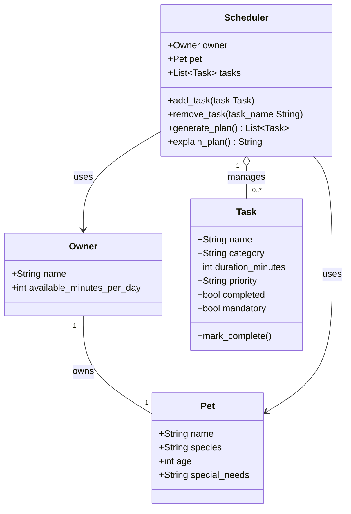

# PawPal+ Project Reflection

## 1. System Design

**a. Initial design**

The three core actions a user should be able to perform in PawPal+ are:

1. **Set up their pet profile** — The user enters basic information about themselves and their pet, such as the pet's name, species, age, special needs, and how much time the owner has available each day. This gives the app the context and constraints needed to personalize care planning.

2. **Add and edit care tasks** — The user creates tasks such as walks, feedings, medication, grooming, or enrichment. Each task includes at minimum a duration and priority level, and some tasks may also be marked mandatory. This allows the system to distinguish between important tasks and tasks that cannot be skipped.

3. **Generate and view today's plan** — The user asks the scheduler to produce a daily care plan. The app selects and orders tasks based on available time, task priority, and whether a task is mandatory, then shows the resulting plan with a short explanation of why tasks were included or skipped.

The initial design uses four classes: `Owner`, `Pet`, `Task`, and `Scheduler`.

`Owner` is a simple data class that holds the owner's name and the number of minutes they have available for pet care each day. Its only responsibility is to carry that time constraint into the scheduler.

`Pet` is also a data class. It stores the pet's name, species, age, and any special needs such as medication or dietary restrictions. It does not contain logic — it exists purely to give the scheduler context about what kind of care the pet requires.

`Task` represents a single care activity. It holds the task name, category, duration in minutes, a priority level (high, medium, or low), a completion flag, and a mandatory flag. The mandatory flag is what separates tasks that must happen regardless of time — like medication — from tasks that are merely important. `Task` has one method, `mark_complete()`, which sets the completed flag to true. Behavior belongs with the data it mutates, so this method lives on `Task` rather than on the scheduler.

`Scheduler` is the only class that contains real logic. It holds a reference to an `Owner`, a `Pet`, and a list of `Task` objects. It is responsible for adding and removing tasks, generating a daily plan that respects the owner's time limit and task priorities, and producing a plain-language explanation of which tasks were scheduled and why others were skipped. The separation between `generate_plan()` and `explain_plan()` keeps data processing and output formatting in distinct methods.

**Classes and responsibilities:**

| Class | Responsibility |
| --- | --- |
| `Owner` | Stores owner profile and the available time constraint (`available_minutes_per_day`) |
| `Pet` | Stores pet profile and care context (`species`, `age`, `special_needs`) |
| `Task` | Represents one care task with duration, priority, completion state, and a `mandatory` flag |
| `Scheduler` | Core logic — holds references to `Owner`, `Pet`, and a task list; generates and explains the daily plan |

**UML class diagram (corrected version):**

**b. Design changes**

Three changes were made after reviewing the skeleton against the design.

**1. Relationship correction — Scheduler → Owner and Scheduler → Pet**
The initial diagram used composition (`*--`) for both relationships. This was corrected to association (`-->`), because `Owner` and `Pet` exist independently of the `Scheduler`. Destroying the scheduler should not destroy the owner or pet. Aggregation (`o--`) was kept for `Task` because the scheduler manages a collection of tasks that can be added or removed without owning their lifecycle.

**2. Added `mandatory: bool` to Task**
High priority alone does not mean a task must happen. A medication task, for example, cannot be skipped just because time runs out. The `mandatory` flag was added to make that distinction explicit in the model. Without it, `generate_plan()` would have no way to differentiate "skip if needed" from "never skip."

**3. Added `PRIORITY_ORDER` constant and fixed `explain_plan()` signature**
A review of the skeleton identified two logic bottlenecks. First, `priority` is stored as a plain string (`"high"`, `"medium"`, `"low"`), which cannot be sorted directly. A module-level `PRIORITY_ORDER` dictionary mapping each label to an integer rank was added so `generate_plan()` can sort tasks correctly without duplicating that mapping inside the method.

Second, `explain_plan()` was originally designed to call `generate_plan()` internally with no parameters. This means the plan would be computed twice whenever a caller used both methods. The signature was updated to `explain_plan(self, plan: list[Task] | None = None)` so a caller can pass in a pre-computed plan and avoid redundant work. If no plan is provided, `explain_plan()` will generate one itself.

---

## 2. Scheduling Logic and Tradeoffs

**a. Constraints and priorities**

The scheduler considers three main constraints: available time, task priority, and whether a task is mandatory. Available time is the hard limit because the owner may only have a certain number of minutes each day for pet care. Priority helps the system decide which non-mandatory tasks should be scheduled first when there is not enough time to complete everything. The mandatory flag is treated as even more important than priority because some tasks, such as medication or feeding, should not be skipped simply because time is limited.

These constraints were chosen because they directly reflect the scenario. The app is supposed to help a busy owner make decisions under limited time, so the scheduler needs to optimize around scarce time while still protecting the pet's essential needs. The first version stays focused on these core constraints instead of adding variables like preferred time of day or task dependencies, because that would increase complexity before the base system was stable.

**b. Tradeoffs**

One tradeoff the scheduler makes is that it may skip lower-priority tasks when the owner does not have enough available time. For example, if the available time only allows for feeding and medication, a lower-priority enrichment activity may be left out of the plan.

This tradeoff is reasonable because the goal of the app is not to create a perfect schedule for every possible task, but to create a realistic daily plan that fits within actual time limits. In this scenario, it is better for the system to guarantee that essential care is completed than to overload the owner with an unrealistic plan that cannot be followed.

A second tradeoff involves how `detect_time_conflicts()` defines a conflict. The method treats any two active tasks that share the same `scheduled_time` string as a conflict, regardless of whether their durations actually overlap. This is exact-time conflict detection rather than full interval-overlap detection. The simpler model is appropriate here because `Task` stores only a start time, not an end time, so there is no data available to compute true overlap. The consequence is a small risk of false positives — two tasks at `"09:00"` could theoretically be run back-to-back if one is short — but for a pet care app at this scale, flagging same-slot collisions for human review is both correct and proportionate. A full interval engine would require storing end times or deriving them from `duration_minutes`, adding model complexity that the current feature set does not justify.

---

## 3. AI Collaboration

### a. AI Strategy (Copilot Usage)

**1. Which Copilot features were most effective?**

Different features proved most useful at different phases of the project. During the design phase, **Plan mode** was the most valuable tool — it was used to reason through class responsibilities before writing any code, specifically to challenge whether `Scheduler` should own the task list directly or whether `Pet` should own tasks and `Scheduler` should only navigate the `Owner → Pet → Task` hierarchy. Plan mode forced a structured rationale before committing to either approach, which prevented a costly architectural reversal later in the project. During implementation, **Agent mode with `#file` context** kept the AI grounded in the actual codebase: pinning `pawpal_system.py` as context meant suggestions for `generate_plan()`, `detect_time_conflicts()`, and `complete_recurring_task()` were aware of the existing data model — `PRIORITY_ORDER`, the `due_date` field, and the `mandatory` flag — rather than inventing new structures that would have conflicted with what was already built. During testing, **`#codebase` context** was most effective, allowing the AI to scan the full module and identify which behaviors had no test coverage yet — for example, the duplicate-future-instance protection path in `complete_recurring_task()` and the explicit exclusion of completed tasks from `detect_time_conflicts()`. The pattern held across all phases: Plan mode for design, `#file` for implementation, Agent mode with `#codebase` for testing and debugging.

**2. One concrete AI suggestion that was rejected or modified**

The AI initially suggested storing tasks directly on `Scheduler` as a flat list — `self.tasks: list[Task]` — rather than having `Scheduler` navigate through `Owner → Pet → Task`. The reasoning offered was simplicity: one list is easier to sort and filter than a nested traversal. This was rejected because it violated the ownership hierarchy that gives the system its semantic structure. A `Task` without a parent `Pet` loses its context — conflict detection needs to know which pet owns which task to distinguish same-pet from cross-pet conflicts, and `filter_by_pet()` would have required storing a pet reference on each `Task`, coupling `Task` to `Pet` in a direction that violates encapsulation. The `Owner → Pet → Task` hierarchy was kept intact, and `Scheduler._collect_all_tasks()` was introduced as a thin internal method to flatten the hierarchy only when needed for iteration, keeping each class responsible for its own data.

**3. How did using separate chat sessions help?**

Keeping design, implementation, and testing in separate sessions prevented context pollution — a single long session accumulates stale assumptions, overruled design sketches, and half-implemented ideas that can resurface as suggestions in later turns, causing the AI to drift from decisions that were already settled. Each session started from a clean slate with only the current file state as ground truth, which made it easier to catch when the AI was drifting from the original design intent: if a testing-phase suggestion started reopening class responsibility questions, that was an immediate signal to redirect rather than a gradual erosion that might go unnoticed in a continuous session.

### b. Lead Architect Reflection

Working as lead architect on PawPal+ clarified that the most important skill in AI-assisted engineering is knowing when not to accept a suggestion. The AI is fast and fluent, but it optimizes for surface plausibility rather than system integrity — it will produce code that compiles and looks reasonable while quietly violating the separation of concerns you spent the design phase establishing. Guiding the AI rather than simply prompting it meant validating every generated method against the actual data model and asking whether it respected the contracts already defined: did `explain_plan()` duplicate work that `generate_plan()` already did, did `detect_time_conflicts()` correctly exclude completed and future-due tasks, did the recurring task logic properly guard against duplicate future instances. Keeping the `Owner → Pet → Task` hierarchy intact required deliberate decisions across multiple sessions — each time the AI suggested a shortcut that would have flattened or bypassed the hierarchy, that shortcut had to be identified and rejected with an explicit reason, not just a vague preference. The biggest lesson from this project is that AI accelerates execution but the architect still owns every design decision that gets committed: accepting the first output blindly would have produced a system that worked in the happy path but broke down under the edge cases the test suite was specifically designed to expose.

---

---

## 4. Testing and Verification

**a. What you tested**

- What behaviors did you test?
- Why were these tests important?

**b. Confidence**

- How confident are you that your scheduler works correctly?
- What edge cases would you test next if you had more time?

---

## 5. Reflection

**a. What went well**

- What part of this project are you most satisfied with?

**b. What you would improve**

- If you had another iteration, what would you improve or redesign?

**c. Key takeaway**

- What is one important thing you learned about designing systems or working with AI on this project?

---

## 6. Phase 4 — Algorithmic Layer: Planning Notes

### Phase 4 Step 1 Complete

**Status:** Step 1 (Review and Plan) is finalized as of 2026-03-29.

**Round 1 Implementation Scope** is deliberately narrow. The goal is algorithm-only improvements with no model changes yet. Two and only two changes will be implemented in Step 2:

1. Shortest-Job-First (SJF) tiebreaker inside `generate_plan()` — when two non-mandatory tasks share the same priority level, the shorter task is scheduled first to maximize the number of tasks that fit within available time.
2. `Scheduler.check_conflicts()` method — detects cases where mandatory tasks collectively exceed `available_minutes_per_day` and returns a structured report of the conflict.

**No filtering yet. No UI changes. No data model changes. No recurrence logic.**

---

### Round 1 Scope Lock

The following is the complete and locked scope for Phase 4, Step 2. Nothing outside this list will be implemented in Round 1.

| Item | In Scope |
| --- | --- |
| SJF tiebreaker in `generate_plan()` | Yes |
| `Scheduler.check_conflicts()` method | Yes |
| Filtering tasks by category or pet | No |
| Changes to `explain_plan()` | No |
| Changes to `app.py` (CLI/UI layer) | No |
| New fields on `Task` (e.g., recurrence) | No |
| Architectural refactoring | No |

---

### Implementation Boundaries

The following actions are explicitly out of scope for Step 2 and must not be introduced:

- **No filtering logic** — do not add category-based, pet-based, or time-of-day filtering to `generate_plan()` or any other method.
- **No changes to `explain_plan()`** — the output format and signature stay as-is. Conflict reporting belongs in `check_conflicts()`, not here.
- **No UI changes** — `app.py` is not touched. CLI commands, prompts, and output formatting are frozen for this round.
- **No new fields on `Task`** — recurrence, scheduled time, and time-of-day preference are deferred. The `Task` dataclass stays at its current shape.
- **No architectural refactoring** — class responsibilities, the `Owner → Pet → Task` hierarchy, and module boundaries are stable and will not be restructured.

Purpose: enforce clean incremental development and prevent scope creep from derailing a focused algorithmic improvement round.
